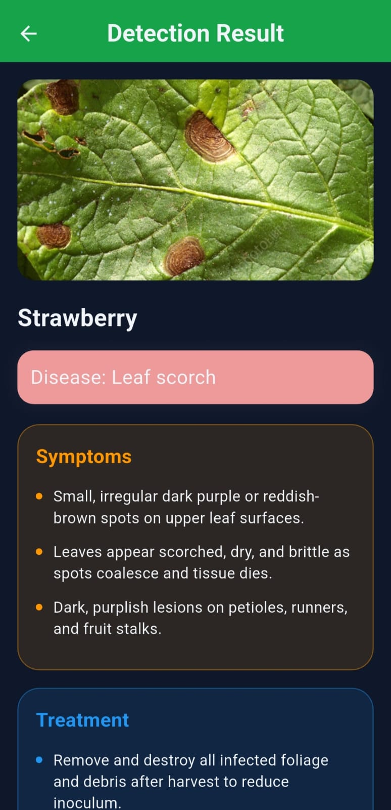

# Mahsoly (محصولي) 🌱

[](https://flutter.dev)
[](https://dart.dev)
[](https://ai.google.dev/)
[](https://pub.dev/packages/flutter_bloc)
[](https://opensource.org/licenses/MIT)

**Mahsoly** is a professional-grade, AI-powered smart agriculture mobile application designed to bridge the gap between advanced data analytics and traditional farming. Developed for agricultural engineers and modern farmers, it provides a comprehensive suite of tools for crop health monitoring, soil analysis, and real-time agricultural consultation.

---

## 📖 Table of Contents
- [Project Overview](#-project-overview)
- [Key Features](#-key-features)
- [System Architecture](#-system-architecture)
- [Technology Stack](#-technology-stack)
- [Project Structure](#-project-structure)
- [Installation & Setup](#-installation--setup)
- [API Integration & Fallback Logic](#-api-integration--fallback-logic)
- [Usage Guide](#-usage-guide)
- [Future Roadmap](#-future-roadmap)
- [Contributing](#-contributing)
- [License](#-license)

---

## 🌟 Project Overview
In the face of global food security challenges, **Mahsoly** empowers users with precision agriculture capabilities. By utilizing Computer Vision for disease detection and LLMs for expert-level advice, the app reduces the dependency on manual inspections and provides immediate, scientifically backed recommendations for crop management.

---

## ✨ Key Features
- **🌿 AI Plant Doctor:** Upload or capture images of infected plants to receive a structured diagnosis including symptoms, causes, prevention, and treatment.
- **💬 Expert Chatbot:** A Gemini-powered agricultural assistant capable of answering complex queries regarding fertilizers, soil chemistry, and farming techniques.
- **🧪 Soil & Fertilizer Analytics:** Advanced predictive models that analyze N-P-K (Nitrogen, Phosphorus, Potassium) levels alongside environmental metrics (Temperature, Humidity, Moisture) to recommend the exact fertilizer type and quantity.
- **🌾 Crop Recommendation:** Suggests the most profitable and sustainable crops based on regional soil data and climate parameters.
- **🎨 Premium UX/UI:** Fully responsive design using `ScreenUtil`, featuring a custom design system with Dark/Light mode synchronization.
- **🔐 Secure Authentication:** Integrated user management system with OTP verification and secure profile management.

---

## 📱 Application Screenshots

<p align="center">
  
  
  
  
</p>

---
## 🏗 System Architecture
Mahsoly is built on a **Clean Architecture** inspired pattern, ensuring high maintainability and testability:

- **Presentation Layer:** Uses the **BLoC/Cubit** pattern for state management. Decouples UI from business logic.
- **Domain/Data Layer:** Repository pattern handles data abstraction. It manages the flow between local cache (`Shared Preferences`) and remote APIs.
- **AI Integration Layer:** A specialized service layer for Gemini API interaction, featuring intelligent JSON sanitization and model fallback logic.
- **Core Layer:** Contains reusable utilities, custom decorations, validators, and application-wide constants.

---

## 🛠 Technology Stack
- **Framework:** [Flutter](https://flutter.dev/) (Channel Stable)
- **State Management:** [Flutter BLoC](https://pub.dev/packages/flutter_bloc) & Cubit
- **Networking:** [Dio](https://pub.dev/packages/dio) with Interceptors for robust HTTP handling
- **AI Models:** [Google Gemini API](https://ai.google.dev/) (Pro and Flash versions)
- **UI Responsiveness:** [Flutter ScreenUtil](https://pub.dev/packages/flutter_screenutil)
- **Local Storage:** [Shared Preferences](https://pub.dev/packages/shared_preferences) for caching and settings
- **Environment Management:** [Flutter Dotenv](https://pub.dev/packages/flutter_dotenv)

---

## 📁 Project Structure
```text
lib/
├── core/                  # Global utilities, theme, and shared widgets
│   ├── cache/             # Local storage helpers
│   ├── constants/         # App colors, API keys, and asset paths
│   ├── functions/         # Reusable logic (Validators, Decorations)
│   ├── networking/        # Dio configuration and API consumers
│   └── theme/             # Custom light/dark design systems
├── feature/               # Feature-based modules
│   ├── auth/              # Login, Signup, OTP, and Profile settings
│   ├── camera/            # Plant disease detection and AI results
│   ├── chat/              # AI Expert chatbot implementation
│   ├── home/              # Dashboard and navigation
│   └── [input_modules]/   # Fertilizer and Soil data collection
└── main.dart              # App entry point and Bloc providers
```

---

## 🚀 Installation & Setup

1. **Clone & Install:**
   ```bash
   git clone https://github.com/your-username/mahsoly.git
   cd mahsoly
   flutter pub get
   ```

2. **Environment Configuration:**
   Create a `.env` file in the root directory:
   ```env
   BASE_URL=https://your-api-endpoint.com
   ```

3. **Assets Setup:**
   Ensure your `assets/` folder contains the required Gilroy fonts and plant images as defined in `pubspec.yaml`.

4. **Run:**
   ```bash
   flutter run
   ```

---

## 🧠 API Integration & Fallback Logic
Mahsoly implements a **Resilient AI Strategy**. In both the Chat and Camera features, the app uses a fallback loop across multiple Gemini models:
- It attempts the request using `gemini-1.5-flash` for speed.
- If a quota or limit error occurs, it automatically falls back to secondary models.
- **JSON Sanitization:** The app includes a custom parser to strip markdown wrappers (e.g., ` ```json `) from AI responses, ensuring 100% successful decoding into the UI models.

---

## 💡 Usage Guide
1. **Analyze a Plant:** Tap the camera icon, take a clear photo of a leaf, and the AI will provide a treatment plan.
2. **Consult the Expert:** Use the Chat tab for text-based questions (e.g., *"What is the best pH for Tomatoes?"*).
3. **Get Recommendations:** Navigate to Fertilizer/Soil inputs, enter your NPK data, and receive a professional analysis.
4. **Customization:** Head to Settings to toggle Dark Mode or update your professional profile.

---

## 🗺 Future Roadmap
- [ ] **Multi-language Localization:** Adding Arabic and French support.
- [ ] **Community Forum:** A space for farmers to share localized advice.
- [ ] **IoT Integration:** Connecting with real-time soil sensors via Bluetooth/WiFi.
- [ ] **Marketplace:** Buying recommended fertilizers directly through the app.

---

## 📄 License
This project is licensed under the MIT License - see the [LICENSE](LICENSE) file for details.

---
Developed with ❤️ by the Mahsoly Team. For academic or professional inquiries, please open an issue in the repository.
